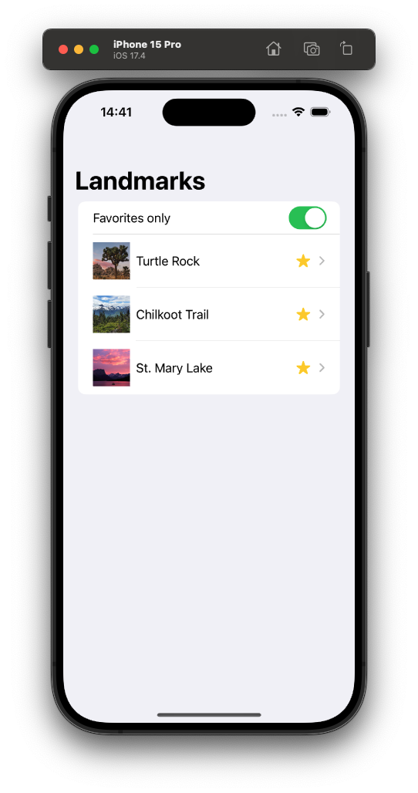
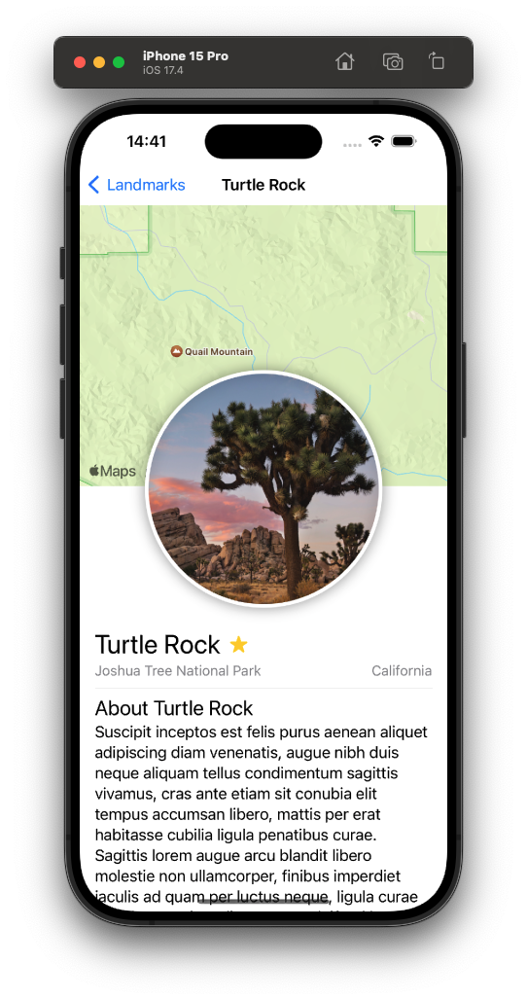
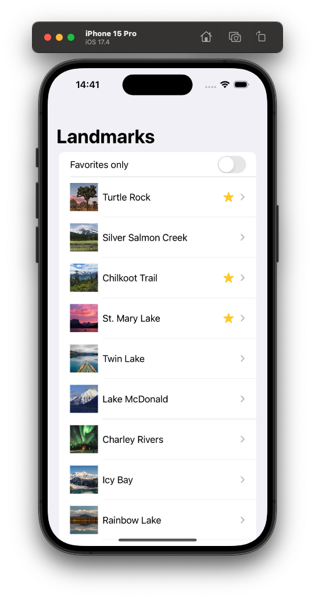

# SwiftGardenPlayground
Explore the jungle of Swift coding with a collection of learning resources. 🪴

### SwiftShrooms: Introducing SwiftUI
---
Simple application made using [SwiftUI Tutorials](https://developer.apple.com/tutorials/swiftui) from Apple Developer.

SwiftUI is a modern way to declare user interfaces for any Apple platform. Create beautiful, dynamic apps faster than ever before.

### Screenshots:

  
   
  

---
